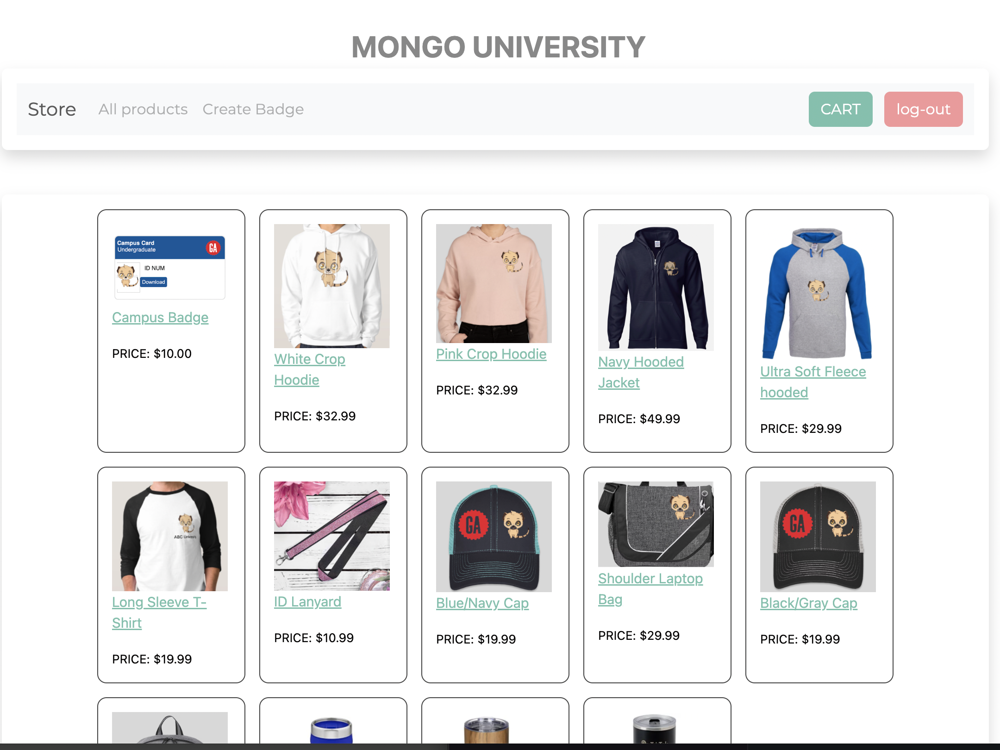
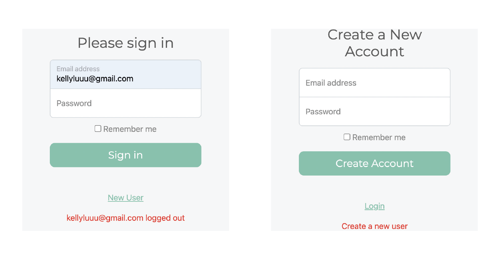
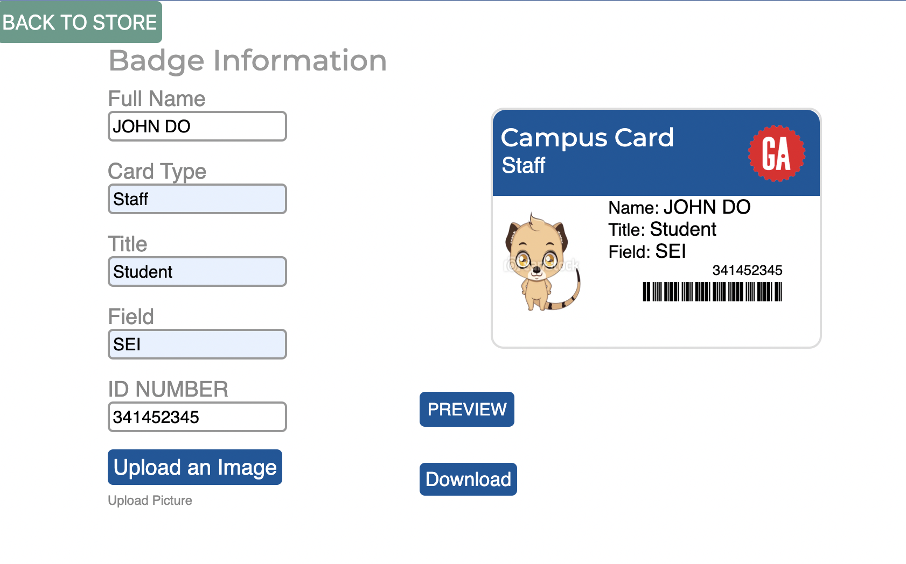
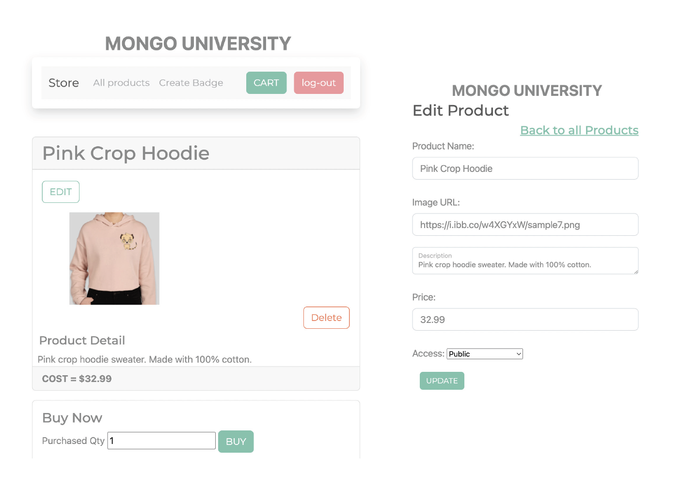

# Ordering Portal for School  

**Summary**
| Field | Detail |
|-------|--------|
| Project Name | Ordering portal for school|
| Description | Website for School to products. Create campus badges, order promotional products, clothing, stationary, and other branded material that the school offers. This enables the school to control cost and promot branding |
| Developers | Kelly Luu |
| Live Website | {[website of deployed application](https://universitystore.herokuapp.com/store)} |
| Repo | {[Link to git repository](https://github.com/kellyluuu/Project2)} |

## Problem Being Solved and Target Market

This portal is a simple way for user to order branded material or crate a new id badge while ensuring brand consistency 

## User Stories

List of stories users should experience when using your application.

- Users should be able to see the site on desktop and mobile
- Users can register a new student or staff
- Users can update a student/staff info
- Users can delete a student/staff
- Users can generate PDF of Student/Staff ID Badge
- Users can add a new products to offer  
- Users can see all their items on the dashboard
- Users can update items
- User can delete items

## Route Tables

For backend Applications you'll want to detail the different routes and types of your request your server can receive. There are three main things to define.

| Endpoint | Method | Response | Other |
| -------- | ------ | -------- | ----- |
| /store | GET | render INDEX.ejs | (INDEX) view all products|
| /store/new | GET | render NEW.ejs | (NEW) view new form to create new prodcut |
| /store | POST |  return JSON of new item | (CREATE) send data to mongodb and redirect to /store |
| /store/:id | GET | JSON of item with matching id number | (SHOW) view of product id selected|
| /store/:id/edit | GET | JSON of item with matching id number | (EDIT) view of product id selected populated in same form as new product page|
| /store/:id | PUT | return update as JSON | (UPDATE) update data in mongodb and redirect to /store/_id  |
| /store/:id | DELETE | delete the item with the matching id | (DELETE) from mongodp and redirect to /store|
| /user | GET | render login.ejs | render login page, create session if login and redirect to store page|
| /user/signup | GET | render signup.ejs | render create new user page|
| /user/signup | POST | return new user info | redirect to login page |
| /user/logout | GET | Destroy session and clear cart and logout |  |
| /user/cart | GET | render cart.ejs | create cart page, calculate total, and download invoice|

## List of Libraries

## Technologies Used:
- JavaScript
- Indesign
- API imgbb
- HTML
- CSS
- dotenv
- bcrypt
- connect-mongo
- express-session
- imgbb-uploader
- ejs
- express
- method-override
- mongoose
- morgan
- bootstrap
- cdnjs html2pdf

## User Interface Mockups

## Actual Site
### Main Page

### Log-in Page

### Generate ID page

### Prodcut and Edit Page

## Next Steps:
- create access level based on user 
- create upload image from local path to generate url 
- Cart page can pull history when user log back in

