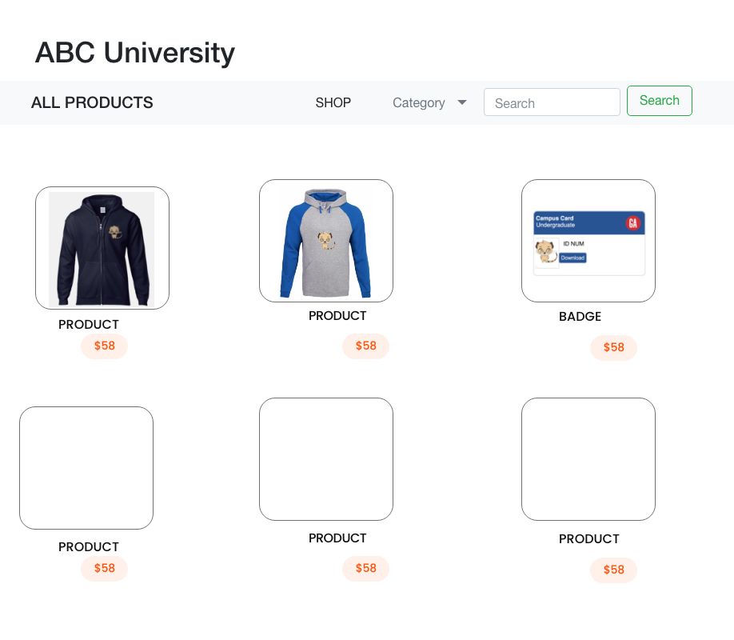

# ABC University's Ordering Portal 

**Summary**
| Field | Detail |
|-------|--------|
| Project Name | ABC University's ordering portal|
| Description | ABC University's ordering portal. Create campus badges, order promotional products, clothing, stationary, and other branded material that the ABC University offers. This enables the University to control its corporate identity by consolidating its products' management, ordering, and distribution, all in one central location. |
| Developers | Kelly Luu |
| Live Website | {website of deployed application} |
| Repo | {Link to git repository} |

## Problem Being Solved and Target Market

This portal is a simple way for user to order branded material or crate a new id badge while ensuring brand consistency 

## User Stories

List of stories users should experience when using your application.

- Users should be able to see the site on desktop and mobile
- Users can register a new student or staff
- Users can update a student/staff info
- Users can delete a student/staff
- Users can generate PDF of Student/Staff ID Badge
- Users can add a new products to offer  
- Users can see all their items on the dashboard
- Users can update items
- User can delete items

## Route Tables

For backend Applications you'll want to detail the different routes and types of your request your server can receive. There are three main things to define.

| Endpoint | Method | Response | Other |
| -------- | ------ | -------- | ----- |
| /store | GET | render INDEX.ejs | (INDEX) view all products|
| /store/new | GET | render NEW.ejs | (NEW) view new form to create new prodcut |
| /store | POST |  return JSON of new item | (CREATE) send data to mongodb and redirect to /store |
| /store/:id | GET | JSON of item with matching id number | (SHOW) view of product id selected|
| /store/:id/edit | GET | JSON of item with matching id number | (EDIT) view of product id selected populated in same form as new product page|
| /store/:id | PUT | return update as JSON | (UPDATE) update data in mongodb and redirect to /store/_id  |
| /store/:id | DELETE | delete the item with the matching id | (DELETE) from mongodp and redirect to /store|

## Route Tables - Items to add after MVP

| Endpoint | Method | Response | Other |
| -------- | ------ | -------- | ----- |
| /auth/signup | POST | creates new user account returns user JSON | new user info must be included in body |
| /auth/login | POST | logs in user and returns user JSON with JWT token | username and password must be included in body |
| /store/cart | GET | render cart.ejs | view all products from 2nd schema (session)|

## List of Libraries

- dotenv
- ejs
- express
- method-override
- mongoose
- pdf-lib
- bootstrap
- morgan

## User Interface Mockups

